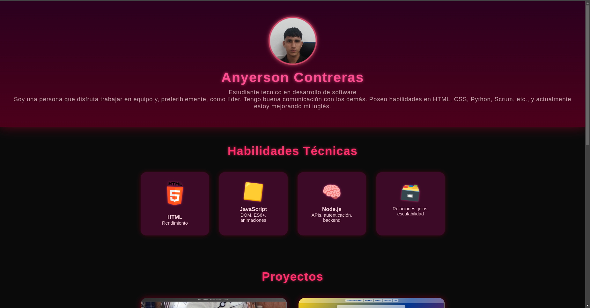

# 💻 Anyerson  Dev - Portafolio Personal

Este es el portafolio web de Anyerson Dev, un desarrollador Full Stack especializado en HTML; CSS Javascript. Aquí se muestran mis habilidades técnicas, proyectos, experiencia laboral y enlaces a redes sociales.

## 🌐 Vista previa

 <!-- Reemplaza con una imagen si tienes -->

---

## 🚀 Tecnologías utilizadas

- **HTML5** + **CSS3**    
- **Animaciones CSS personalizadas**
- **Diseño responsivo** (grid adaptable)
- **Íconos externos** vía Flaticon / SimpleIcons
- **Efectos visuales**: sombras, transformaciones 3D, transiciones

---

## 📁 Estructura del proyecto

```
/assets/
  profile.png             # Foto de perfil
  /icons/                 # Íconos sociales descargados
    github.png
    linkedin.png
    ...
index.html                # Página principal
style.css                 # Estilos personalizados
README.md                 # Este archivo
favicon.ico               # Ícono para navegador
```

---


### 2. Abrir en navegador

Puedes abrir `index.html` directamente con doble clic o usar un servidor local:

```bash
# Con VSCode:
Live Server → "Open with Live Server"
```

---


### 🎨 Colores y estilos

Edita el archivo `style.css` para modificar:
- Gradientes del encabezado (`header`)
- Colores de fondo de cada sección
- Efectos hover
- Sombra y transiciones 3D


## 📲 Favicon personalizado

Coloca un archivo `favicon.ico` en la raíz del proyecto y añade en `<head>`:

```html
<link rel="icon" type="image/x-icon" href="favicon.ico" />
```

---

## 📦 Despliegue

Puedes desplegar este portafolio fácilmente en:

- **GitHub Pages**
  - Subir el código a un repositorio
  - Ir a _Settings → Pages → Source: `main / root`_
- **Vercel**
  - [https://vercel.com/](https://vercel.com/)
- **Netlify**
  - [https://netlify.com/](https://netlify.com/)

---

## 🛡️ Licencia

Este proyecto está bajo la licencia [MIT](LICENSE).  
Puedes usarlo y modificarlo libremente, ¡pero no olvides dar crédito si lo compartes públicamente!

---

## ✨ Créditos

- Iconos de [Flaticon](https://www.flaticon.com/)
- Logos de [Simple Icons](https://simpleicons.org/)
- Fuente: Segoe UI
- Animaciones personalizadas por Cristian Dev

---

## 🙌 Contáctame

¿Te gustó el portafolio o quieres trabajar conmigo?

📧 **cristian.diaz8918@gmail.com**   
🐙 [GitHub](https://github.com/anyerson2007)

---
